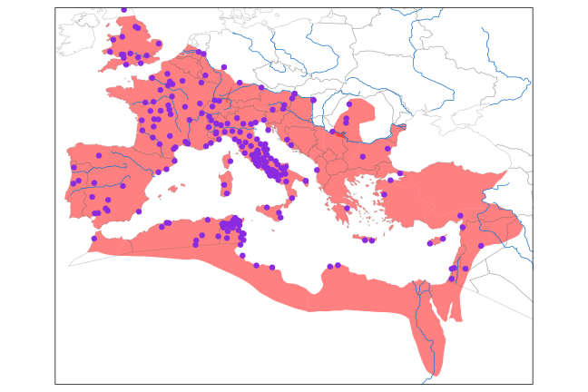

Most recent draft release: 

roman-amphitheaters
===================

Edited by Sebastian Heath.

# Introduction
'roman-amphitheaters' is a dataset published in conjunction with accompanying figures and discussion that has the goal of facilitating the study of amphitheaters in the Roman world, with a focus on the Imperial period. For the purposes of this project, the category 'amphitheater' comprises the oval buildings with relatively large seating capacity that is arrayed around a flat arena in which a variety of entertainments - such as animal hunts, executions, and gladiatorial combat -  took place. It is important to note that no one of those three broad categories of activity took place only in amphitheaters. Therefore this dataset is not a complete map of any single Roman behavior. While it is the case that amphitheaters are distinctly 'Roman' given that they do not appear outside the territory of the Empire, they cannot be said to be a necessary component of Roman culture given that their distribution is very unequal in the territory that was firmly under imperial control. The publication of this dataset,  and of the figures that use it, is intended to explore this tension between amphitheaters as a regular, but neither necessary nor universal, feature of Roman presence in regions that Rome conquered.

# The Dataset
 The primary version of the data is the geojson file 'roman-amphitheaters.geojson', which can be rendered as a map by a variety of freely-available tools. Other data files are derived from that geojson.

Like much information related to the Roman Empire, and to antiquity more generally, it is unlikely that any single listing of structures can achieve universal recognition as being either complete or finished. While there are over 200 structures that are uncontroversially recognized as within the category, others are not so easily included or rejected. In this dataset, so-called 'Gall-Roman' amphitheaters that combine features of theaters and amphitheaters are, or will be, included. Theaters that were later converted for display of gladiatorial combat are not.

Wikipedia's list of Roman amphitheaters at http://en.wikipedia.org/wiki/List_of_Roman_amphitheatres was an early source for the initial versions of this list.  Tom Elliot added data from the Pleiades Project. In summer 2015, D. Bennett added orientation and other data. The full history of edits and contributions are available in the history of this github repository.

# Two Distribution Maps

# Citation
Citation practices for datasets are still being discussed and developed by the academic community. In order to facilitate such best practices, *roman-amphitheaters* is periodically released as 
